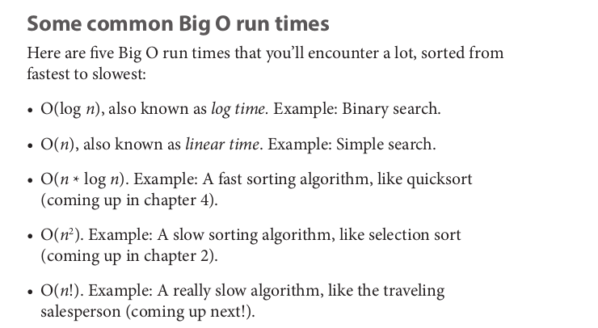

# Binary Search
 - input should be sorted list of elements --> [1, 2,3], ['a', 'b', 'c']
 - if the element you're searching for is in the list, it should send its position otherwise sends null.
 - Binary search mechanism is splitting data into halfs eleminate one half depend on the entered value, search number between 1-->100
 first guess: 50, no its higher --> second guess should be 50+100/2 --> 75, no it's lower! 50+75/2 --> almost 63, and so on..


 What's the difference here? 
 - if you use tradition way to search thing, you'll have to go step by step which means go from 1 up to 100 number of guesses until you reach the targeted number in ALgebra linear search where f(x) = x + c, unlike binary search which uses **Logarithmatic** search

### Logarithms in short:
- log<sub>10</sub> 100 means how many 'tens' we need to reach 100!! TEN*TEN!!!So we need two '10s' to get 100 so log<sub>10</sub> 100 = 2!

NB: *logs are the vers of exponentials!!*

- So for a list of 8 numbers, you’d have to check 8 numbers at most.
For binary search, you have to check log n elements in the worst case. For
a list of 8 elements, log 8 == 3, because 23
 == 8. So for a list of 8 numbers,
you would have to check 3 numbers at most. For a list of 1,024 elements,
log 1,024 = 10, because 210 == 1,024. So for a list of 1,024 numbers, you’d
have to check 10 numbers at most. **log <sub> 2 </sub> (n)**

----------------------------------------------

# Big O Notation:
- Big O notation is special notation that tells you how fast an algorithm is. you need to know how
the running time increases as the list size increases.

- Big O notation lets you compare the number of operations you need to make not how many seconds it takes.

- O --> big O, (n) --> number of operations.
- Big O is about the worst case scenario: 
```
Simple Search: You want to find number 1 using simple search in sorted list, so it only takes one operation as one is the first element in array so it will be O(1) operation, but finding what you search isnot always first element * Happy Case * we design on the worst case scenario which means that you want to find index of number 1000000000000 in array of sorted elements of 1000000000000 so it will take O(1000000000000) to find this number 
```


## Travelling Sales Person:
- Travelling Sales person is an example of O(n!) where the sales person wants to hit 5 cities in minimum amount of distance so he has to calculate 5! **120** possibility "*operation*" to find the minimum distance, if we make it 6 cities it will be 6! 720 possibility "*operation*" until you find the minimum distance.


## Recap
• Binary search is a lot faster than simple search.
• O(log n) is faster than O(n), but it gets a lot faster once the list of
items you’re searching through grows.
• Algorithm speed isn’t measured in seconds.
• Algorithm times are measured in terms of growth of an algorithm.
• Algorithm times are written in Big O notation.