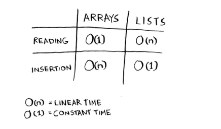

# Selection Sort:

## How memory works: 
- Computer looks like a giant set of drawers, and
each drawer has an address.
- Each time you want to store an item in memory, you ask the computer
for some space, and it gives you an address where you can store your
item.
- If you want to store multiple items, there are two basic ways to
do so: arrays and lists

- Storing in Arrays means your items will be stored next to each other array element has refrence to its first item in memory and you'll just add number of bytes of your data type to get the second item of array and so on..
- You need to ask your
computer for a different chunk of memory if you want to add onther element to this array, and the next place is filled with another data, that's why arrays in most cases should be initialized by how much it takes in memory. 

- Linked List solve memory problems issue because it doesn't need to be contigeous, by making item stores the address of the next item in the list. A bunch of
random memory addresses are linked together. *linked list better than arrays in insert*

- in accessing elements directly array is better, because in linked list you dont know the address of last element you have to iterate through them to find the address which stored inside the node before the last one, to reach last one.




## Deletion:
- Lists are better beacause operation is 1, as you'll only need to change previous element to point to the next of the next element.
- in Array you'll need to shift all elements.
- Unlike insertions, deletions will always work. Insertions can fail
sometimes when there’s no space left in memory. But you can always
delete an element. 

- It’s worth mentioning that insertions and deletions are O(1) time only
if you can instantly access the element to be deleted. It’s a common
practice to keep track of the first and last items in a linked list, so it
would take only O(1) time to delete those.

- Binary search is better with array because you need random access.


### selection sort:
```
function selectionSort(array) { //110,150,2
  for (let i = 0; i < array.length; i++) {
      let minIndex=i;
      
      for (let j = i+1; j < array.length; j++) {
          if (array[minIndex]> array[j]) {
              minIndex=j;
          }        
      }

      let tmp=array[i];
      array[i]=array[minIndex];
      array[minIndex]=tmp;
      
  }

  return array;
}

 console.log(selectionSort([5,3,55,47,1,2,5,17,88,1025,44,4,5]));


console.log(selectionSort([110,150,2]))
````
- Pick first index, assume it has the smallest value "min index"!
- loop over the array, check if the element in the picked element is smallest than the next, if yes! make this index the "min index" continue looping...
- once you reached the end of array swap the current "i" array val with the min index array value, increment "i", start all over again!

This operation of worst case scenario O(n^2), you've to iterate through the array once for every value! same for best case scenario "Array is Sorted" O(n^2)