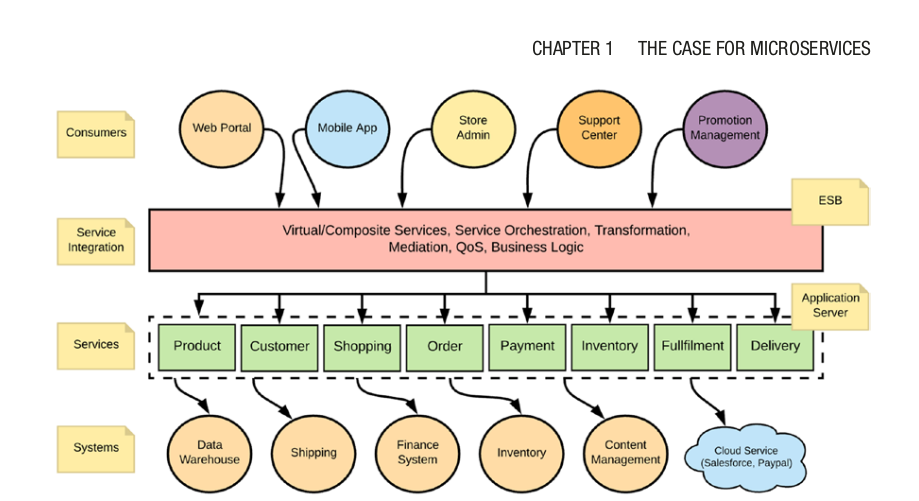

# The Case Of Microservice
- Microservices are services that deployed, scaled and devrloped indpendently.
## What's the proplem with Monolithic Apps:
- redeploy entire app.
- When things gets bigger it gets complex
- when things gets bigger IDE gets slower when you do testing for a feature.
- unstable service will bring app down 
- conflicting resource requirements. (For example, since a monolithic
application offers multiple business capabilities, one capability may
require more CPU while another requires more memory. It’s hard to
cater to the individual needs of these capabilities.

## service oriented architecture:
- Segregating functionalities to small service indepentent of each other "loosely coupled architecture", interfaces no concern about implementation

- Some common functionalities are written in the esb layer, like security and monitoring and business logic integration.
- The ESB layer is a monolithic entity where
all developers share the same runtime to develop/deploy their service integrations.

## API
- is used to expose those web service functionalities
- The API layer is also used for security,
throttling, caching, and monetization.
- throttle means in simple defintion like a web server allowing only 10 users at a time 

### Microservice:
- Getting rid of ESB Layer by making service intercommunicate with other service

## Main Characterstics: 